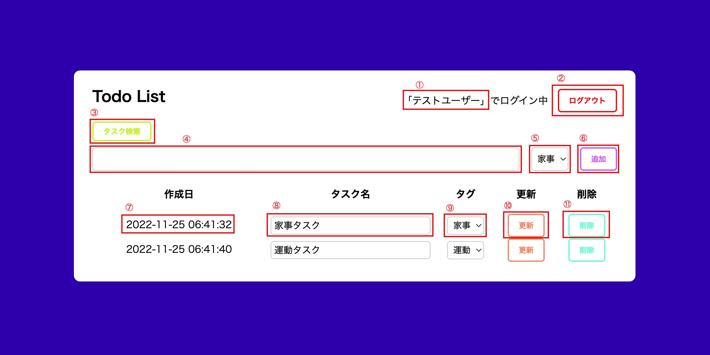
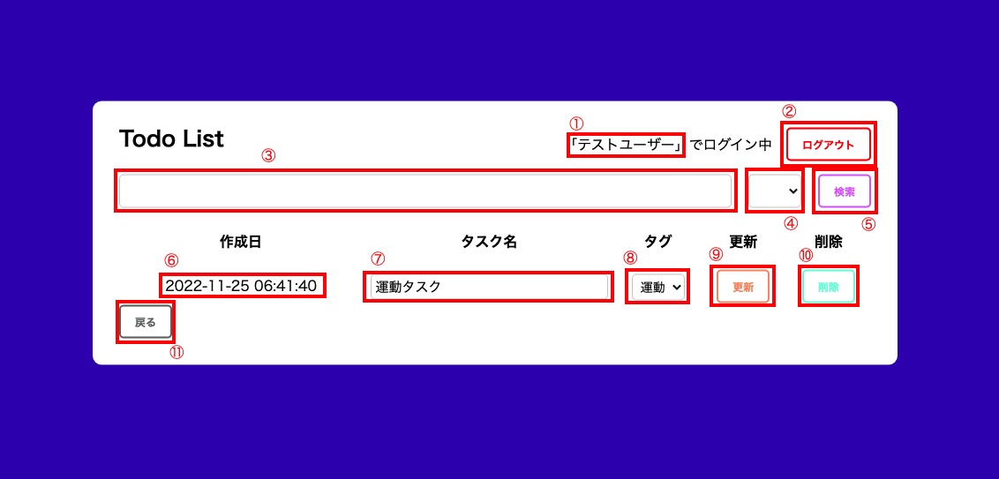
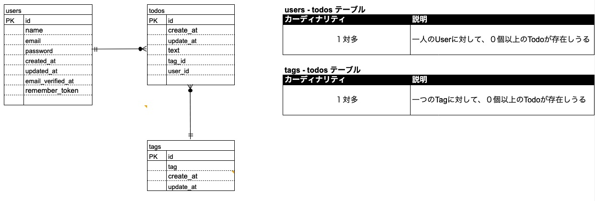

# Todo 管理アプリ

## 1. 概要説明（どんなアプリか）
### 1.1 トップページ
 

#### ▼ 概要

| No  | 項目名     | 項目種類 | 説明                                        |
| :-- | :--------- | :------- | :------------------------------------------ |
| ①   | ログイン情報  | Text 　　　　　　| ログインユーザ名を表示 |
| ②   | ログアウトボタン | Button | ログアウトを実行する                   |
| ③   | タスク検索ボタン | Button  | タスク検索ページに移動                           |
| ④   | Todo名    | TextBox  | Todoを新規作成するためのTodo名を入力         |
| ⑤   | タグ選択 | SelectList   | 新規作成Todoのタグを選択する                       |
| ⑥   | 作成ボタン | Button   | Todoの新規作成を実行する                       |
| ⑦   | 作成日 | Text   | Todoの作成日を表示                       |
| ⑧   | Todo名 | TextBox   | Todoの更新をするためのTodo名入力欄                       |
| ⑨   | タグ | SelectList   | 該当Todoのタグを表示、更新タグを選択                       |
| ⑩   | 更新ボタン | Button   | Todoの更新を実行する                       |
| ⑪   | 削除ボタン | Button   | Todoの削除を実行する                       |

### 1.2 検索ページ
 

#### ▼ 概要

| No  | 項目名     | 項目種類 | 説明                                        |
| :-- | :--------- | :------- | :------------------------------------------ |
| ①   | ログイン情報  | Text 　　　　　　| ログインユーザ名を表示 |
| ②   | ログアウトボタン | Button | ログアウトを実行する                   |
| ②   | ログアウトボタン | Button | ログアウトを実行する                   |
| ③   | Todo名    | TextBox  | 検索したいTodo名を入力         |
| ④   | タグ選択 | SelectList   | 検索したいタグ名を入力                       |
| ⑤   | 検索ボタン | Button   | Todoの検索を実行する                       |
| ⑥   | 作成日 | Text   | Todoの作成日を表示                       |
| ⑦   | Todo名 | TextBox   | Todoの更新をするためのTodo名入力欄                       |
| ⑧   | タグ | SelectList   | 該当Todoのタグを表示、更新タグを選択                       |
| ⑨   | 更新ボタン | Button   | Todoの更新を実行する                       |
| ⑩   | 削除ボタン | Button   | Todoの削除を実行する                       |
| ⑪   | 戻るボタン | Button   | トップページに戻る                       |

 

## 2. 作成した目的

日々の Todo 管理のため

 

## 3. 機能一覧

-   Todo の新規追加
-   Todo の更新
-   Todo の削除
-   認証機能の実装

 

## 4. 使用技術（実行環境）

-   Laravel 8.83.25

 

## 5. テーブル設計
### 5.1. DB名
- todolistdb
 

### 5.2. todosテーブル
| カラム名  |     型      | Primary Key | Unique Key | Not Null | Foreign Key |     others     |
| :-------: | :---------: | :---------: | :--------: | :------: | :---------: | :------------: |
|    id     | bigint(20)  |      ○      |            |    ○     |             | AUTO_INCREMENT |
| create_at |  timestamp  |             |            |          |             |                |
| update_at |  timestamp  |             |            |          |             |                |
|   text    | varchar(20) |             |            |    ○     |             |                |
|   tag_id  | bigint(20)  |             |            |    ○     |      ○      |                |
|   user_id | bigint(20)  |             |            |    ○     |      ○      |                |
 

### 5.3. usersテーブル
| カラム名               |     型          | Primary Key | Unique Key | Not Null | Foreign Key |     others     |
| :------------------: | :-----------: | :---------: | :----------: | :------: | :---------: | :------------: |
|    id                | bigint(20)    |      ○      |              |    ○     |             | AUTO_INCREMENT |
|   name               | varchar(255)  |             |              |    ○     |             |                |
|   email              | varchar(255)  |             |      ○       |    ○     |             |                |
|   password           | varchar(20)   |             |              |    ○     |             |                |
|   create_at          |  timestamp    |             |              |          |             |                |
|   update_at          |  timestamp    |             |              |          |             |                |
|   email_verified_at  | timestamp     |             |              |          |             |                |
|   remember_token     | timestamp     |             |              |          |             |                |
 

### 5.4. tagsテーブル
| カラム名    |     型        | Primary Key | Unique Key | Not Null | Foreign Key |     others     |
| :-------: | :-----------: | :---------: | :--------: | :------: | :---------: | :------------: |
|    id     | bigint(20)    |      ○      |            |    ○     |             | AUTO_INCREMENT |
| create_at |  timestamp    |             |            |    ○     |             |                |
| update_at |  timestamp    |             |            |          |             |                |
|   tag     | varchar(255)  |             |            |          |             |                |
 

## 6. ER 図

 

 

## 7. その他

-   Todo 名は1文字以上20文字以下であること
-   ユーザー名は8文字以上191文字以下であること
-   パスワードは8文字以上191文字以下であること
